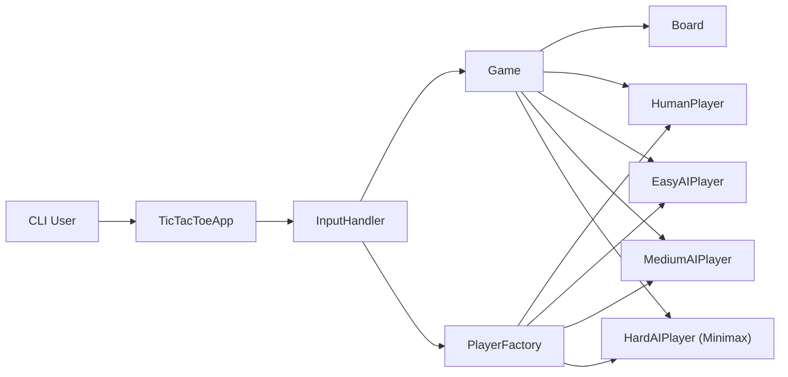

# Tic-Tac-Toe AI - Production-Style Console Game Engine

A Java console application for Tic-Tac-Toe with multiple player modes (`user`, `easy`, `medium`, `hard`), configurable board sizes, and customizable symbols.
The project demonstrates clean game-loop orchestration, strategy-based AI behavior, and robust command parsing for interactive gameplay.

## Highlights

- Multi-mode match setup via `start <playerX> <playerO> [boardSize] [symbolX symbolO]`
- Strategy-based AI implementations:
  - `easy` - random valid move
  - `medium` - win/block/random heuristic
  - `hard` - Minimax-based optimal decision making
- Human vs AI, AI vs AI, and human vs human game modes
- Dynamic board support from `3x3` to `10x10`
- Input validation for command format, board constraints, and symbol correctness

## Architecture



### How it works (high level)

- `TicTacToeApp` reads commands in a loop until `exit`.
- `InputHandler` validates and parses runtime configuration (players, board size, optional symbols).
- `PlayerFactory` creates player strategy instances for `X` and `O`.
- `Game` controls turn rotation, delegates move decisions, and renders board states.
- `Board` validates moves and calculates terminal states (`X wins`, `O wins`, `Draw`).

## Engineering Challenges

- Keeping command parsing extensible while supporting multiple input signatures
- Scaling winner/draw checks from fixed 3x3 to variable board sizes
- Implementing AI strategies with clear progression in difficulty and behavior
- Preserving consistent turn logic across all combinations of human/AI players

## My Contribution

- Implemented command-driven game bootstrap with validation and parse flows.
- Added player factory abstraction for interchangeable human and AI strategies.
- Implemented easy, medium, and hard AI levels, including Minimax for hard mode.
- Added configurable board size and custom symbol support.
- Built a reusable game loop with centralized board rendering and result detection.

## Tech Stack

- **Language:** Java 17
- **Architecture:** OOP with strategy/factory patterns
- **Interface:** Interactive console CLI
- **Build/Run:** `javac` / `java`

## Quick Start

### Prerequisites

- Java 17+

### Compile and run

```bash
git clone https://github.com/DiacencoDumitru/tic-tac-toe-ai.git
cd tic-tac-toe-ai
javac -d out $(find src -name "*.java")
java -cp out tictactoe.TicTacToeApp
```

## How to Verify

```bash
# compile
javac -d out $(find src -name "*.java")

# run interactive shell
java -cp out tictactoe.TicTacToeApp
```

Try representative commands:

- `start user easy`
- `start medium hard`
- `start user user 5`
- `start easy medium 7 X O`
- `exit`

## CLI Commands

- `start <playerX> <playerO>` - start default 3x3 game (`X`, `O`)
- `start <playerX> <playerO> <boardSize>` - start custom-sized game (`3..10`)
- `start <playerX> <playerO> <boardSize> <symbolX> <symbolO>` - custom size and symbols
- `exit` - quit app

Supported player types: `user`, `easy`, `medium`, `hard`.

## Why This Project

This project demonstrates interview-relevant game engine fundamentals:

- strategy-based AI architecture
- deterministic turn-state management
- extensible input handling and validation
- algorithmic decision logic (Minimax) in a practical runtime loop

## Project Structure

- `src/tictactoe` - game loop, board model, application entry
- `src/handler` - input validation and parsing
- `src/factory` - player abstractions and AI implementations
- `README.md` - project documentation

## Author

Dumitru Diacenco, Java Backend Engineer
